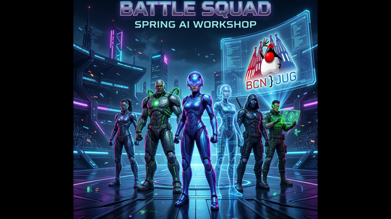

# Battle Contender: Spring Boot & AI Workshop



Welcome to the **Battle Contender** workshop template! In this workshop, you will learn how to build an AI-powered agent using **Spring Boot 4**, **Spring AI 2.0**, and **Java 25**. Your agent will interact with the "Superhero Battle Arena" API to register a team, analyze game constraints, and use an LLM advisor to pick an optimal hero squad within a budget!

## 🚀 Workshop Structure

This repository contains the `main` branch, which serves as the starter project. The backend scaffolding and the HTML frontend (`src/main/resources/static/index.html`) are already built.

Your goal is to implement the **Spring AI** layer.

### What You Will Build

1. **AI Tools (`@Tool`)**: Wrap the Arena API endpoints so the LLM can search for heroes and manage arena sessions.
2. **AI Service Layer**: Configure the Spring AI `ChatClient` with a system prompt and your `@Tool` components.
3. **Structured Output**: Direct the AI to parse its reasoning and squad selection into a Java Record (`SquadRecommendation`).

### TODO Locations

Look for `UnsupportedOperationException("TODO:...")` in the codebase. The primary files you need to modify are:

* `src/main/java/com/workshop/battlecontender/ai/tools/HeroSearchTool.java`
* `src/main/java/com/workshop/battlecontender/ai/tools/ArenaManagementTool.java`
* `src/main/java/com/workshop/battlecontender/ai/BattleAdvisorService.java`

You can verify your implementation by running the provided tests:

```bash
./mvnw clean test
```

## ⚙️ Setup Instructions

### Prerequisites

* **Java 25** installed on your machine.
* An API Key for your preferred AI Provider.

### 1. Choose Your AI Provider

This project is configured with Maven profiles to support multiple AI providers. You only need to use **one**.

| Profile | Provider | Required Config |
| :--- | :--- | :--- |
| `openai` (Default) | OpenAI | `spring.ai.openai.api-key` |
| `vertex-ai` | Google Vertex AI | `spring.ai.vertex.ai.gemini.project-id` & `location` |
| `anthropic` | Anthropic | `spring.ai.anthropic.api-key` |
| `ollama` | Ollama (Local) | *Make sure Ollama is running (`llama3.2`)* |

### 2. Configure Credentials

Set your API key as an environment variable before running the application.

**For OpenAI (Default):**

```bash
export OPENAI_API_KEY="your-api-key"
```

**For Vertex AI:**

```bash
export GCP_PROJECT_ID="your-project"
export GCP_LOCATION="europe-west1"
# Ensure you are authenticated with gcloud: `gcloud auth application-default login`
```

### 3. Run the Application

Use the Maven wrapper to run the project.

```bash
# Run with OpenAI (default profile)
./mvnw spring-boot:run

# Or run with a specific profile
./mvnw spring-boot:run -Pvertex-ai
./mvnw spring-boot:run -Ppostcss # If you want to use anthropic
./mvnw spring-boot:run -Pollama
```

### 4. Play the Game

Once the application starts, navigate to:
**<http://localhost:8080>**

1. Register your team.
2. Ensure the active Session is loaded.
3. Select an Open Round.
4. Click the **"✨ Optimize with AI"** button to see your AI code in action!

Good luck, Contender!
